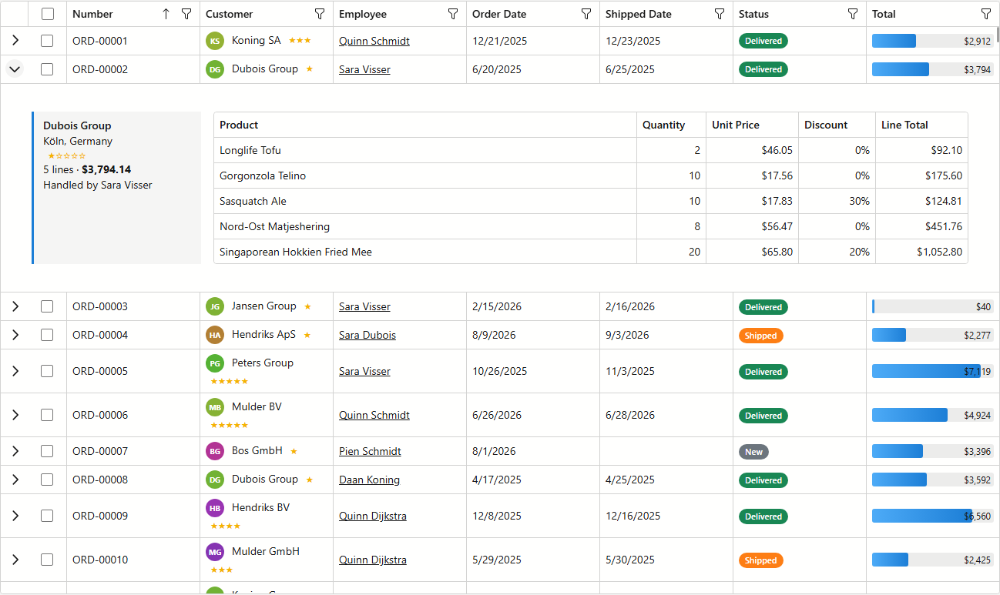

# xafgrid

<picture>
  <source media="(prefers-color-scheme: dark)" srcset="docs/screens/hero-dark.png">
  
</picture>

What can the DevExpress Blazor `DxGrid` do inside an XAF ListView **beyond what the Model Editor
offers** — when you drive it from code via `DxGridListEditor`?

An XAF Blazor Server app (DevExpress 26.1, EF Core, SQLite, no security) where every navigation
item under **Grid Demos** is one ListView + one ViewController showing a single grid capability,
each verified by a Playwright (C#/NUnit) test with a screenshot.

| # | Demo | DxGrid members |
|---|---|---|
| — | Showcase: D1 + D2 on one grid (the image above) | both controllers target it via `TargetViewId` |
| D1 | Master-detail row (nested lines grid) | `DetailRowTemplate` |
| D2 | Rich cells: badges, stars, inline bars, avatars | `DataColumnCellDisplayTemplate` |
| D3 | Row heat-map / cell highlight beyond Conditional Appearance | `CustomizeElement` |
| D4 | Custom grouping + group-row template | `CustomGroup`, `DataColumnGroupRowTemplate` |
| D5 | Custom summaries, two-line footers | `CustomSummary`, `ColumnFooterTemplate` |
| D6 | In-grid toolbar: expand/auto-fit/XLSX export | `ToolbarTemplate`, `IGrid.ExportToXlsxAsync` |
| D7 | Unbound / computed columns | `AddColumnModel`, `UnboundColumnData` |
| D8 | Drag rows to reorder, persisted | `ItemsDropped`, `AllowedDropTarget` |
| D9 | Named layout presets stored in the database | `IGrid.SaveLayout` / `LoadLayout` |
| D10 | Wide grid: fixed columns, header icons, column virtualization | `FixedPosition`, `VirtualScrollingMode` |

**Using one of these in your own app:** [`HOW-TO-IMPLEMENT.md`](HOW-TO-IMPLEMENT.md).
Per-demo verdicts (what worked, what XAF blocks, dxdocs references): [`docs/findings.md`](docs/findings.md).
Design and phase plan: [`docs/superpowers/specs/2026-09-02-xafgrid-design.md`](docs/superpowers/specs/2026-09-02-xafgrid-design.md).

## Run

Building needs the DevExpress NuGet feed (a DevExpress subscription); everything else is plain .NET 8.

```
dotnet run --project XafGrid.Blazor.Server
```

The SQLite database (`XafGrid.Blazor.Server/xafgrid.db`) is created and seeded on first start
(50 customers, 1 500 orders).

## Test

```
dotnet test XafGrid.Tests.Playwright
```

The fixture deletes the database, starts the built app on a fixed port and screenshots every
demo into `XafGrid.Tests.Playwright/TestResults/screens/`.

## License

[MIT](LICENSE). The DevExpress components it uses are commercial and licensed separately.
